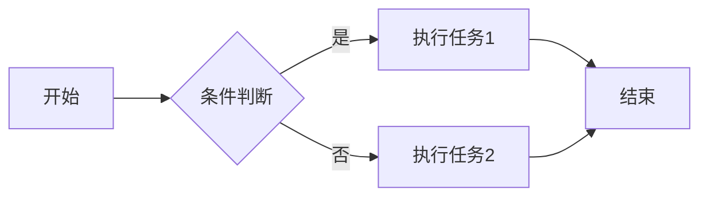
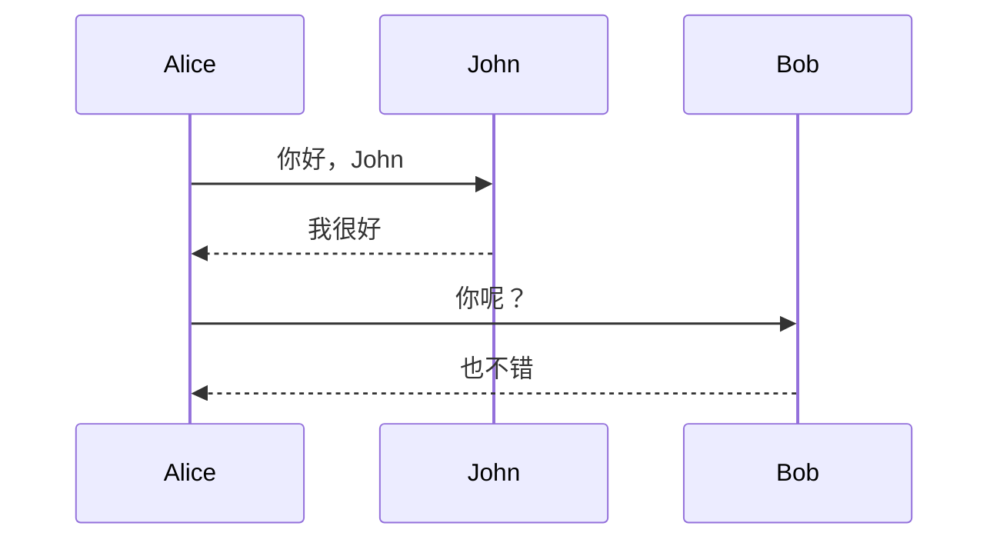
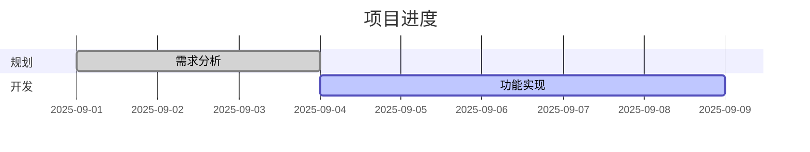

# 狂揽82.7k的star，这款开源可视化神器，轻松创建流程图和图表


作为常年和代码、文档打交道的开发者，你是否也曾为 “画一张清晰的架构图” 而头疼？用 Visio 要手动拖拽元素，用 DrawIO 调整格式耗半天，好不容易画完的图还没法和代码同步更新 —— 直到星哥发现了 **Mermaid** 这款开源神器，才真正实现 “文档和代码同频迭代”。


---

## 🐬 什么是 Mermaid？

Mermaid 是一款基于 JavaScript 的开源图表生成工具，通过简洁的文本语法（类似 Markdown）快速创建流程图、时序图、甘特图、类图、状态图等十余种专业图表，广泛应用于技术文档编写、项目管理和系统架构可视化场景。


它的核心理念是：**让文档与开发同步演进，降低“文档腐烂”风险**。

> 简单来说，你只需要写几行文本，就能生成流程图、时序图、甘特图、类图、状态图、饼图、Git 分支图等多种可视化图表。

**Mermaid-js的核心破局点**

- **告别手动绘制**：用类Markdown的简洁语法描述图表，几行代码就能生成流程图、时序图、架构图
- **与文档同步进化**：图表代码可嵌入文档，修改时只需更新代码，图表自动渲染最新版本
- **全团队友好**：语法简单直观，非程序员也能快速上手，真正实现“谁写文档谁维护图表”


---

## ✨ 核心优势

- **文本驱动**：用简单的语法描述图表，版本可控，方便协作。
- **多种图表类型**：支持 Flowchart、Sequence Diagram、Gantt、Class Diagram、State Diagram、Pie Chart、Git Graph 等。
- **跨平台集成**：可直接在 GitHub、GitLab、Notion、Obsidian 等平台渲染。
- **实时预览**：内置 [Mermaid Live Editor](https://mermaid.live)，边写边看效果。
- **可嵌入生产环境**：支持在 CI/CD 流程、文档生成器、前端项目中直接调用。

---

## 🔧 如何使用

### 在线体验

 打开 [Mermaid Live Editor](https://mermaid.live/)，输入语法即可实时生成图表。

### Docker 安装命令

前提是需要安装Docker

```
docker run -p 8000:8080 --name mermaid-live-editor \
-d ghcr.io/mermaid-js/mermaid-live-editor
```

安装完成之后，我们可以通过访问：IP:8000 在线使用它。


### 本地集成 

 在前端项目中安装：

```bash
npm install mermaid
```

在代码中引入：

```javascript
import mermaid from 'mermaid';
mermaid.initialize({ startOnLoad: true });
```

## 📊 常见图表示例

### 1. 流程图（Flowchart）



### 2. 时序图（Sequence Diagram）



### 3. 甘特图（Gantt Chart）



### 4.类图

```
classDiagram
Class01 <|-- AveryLongClass : Cool
<<Interface>> Class01
Class09 --> C2 : Where am I?
Class09 --* C3
Class09 --|> Class07
Class07 : equals()
Class07 : Object[] elementData
Class01 : size()
Class01 : int chimp
Class01 : int gorilla
class Class10 {
  <<service>>
  int id
  size()
}
```


### 5.饼图

```
pie
"Dogs" : 386
"Cats" : 85
"Rats" : 15
```


### 6.用户体验旅程图

```
  journey
    title My working day
    section Go to work
      Make tea: 5: Me
      Go upstairs: 3: Me
      Do work: 1: Me, Cat
    section Go home
      Go downstairs: 5: Me
      Sit down: 3: Me
```


------


## 🌟 总结

如果你厌倦了反复拖拽绘图、截图、更新文档的繁琐流程，Mermaid 绝对值得一试。 它不仅能让你的技术文档更直观、更专业，还能与代码版本管理无缝结合，让图表真正成为活文档。

```
开源地址：https://github.com/mermaid-js/mermaid  

简体中文Readme：https://github.com/mermaid-js/mermaid/blob/develop/README.zh-CN.md

在线编辑器：https://mermaid.live
```


星哥建议从今天起，把你的架构图、流程图都用 Mermaid 管起来，省时、省心、还很酷。

写文不易，如果你都看到了这里，请点个赞和在看，分享给更多的朋友；也别忘了关注星哥玩云！这里有满满的干货分享，还有轻松有趣的技术交流～点个赞、分享给身边的小伙伴，一起成长，一起玩转技术世界吧！ 😊


