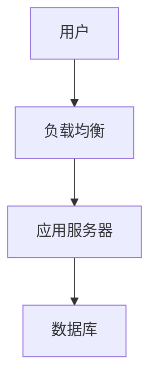

# 微信排版效率炸裂！试试这款开源Markdown神器


大家好，我是星哥，作为一个常年跟公众号打交道的技术博主，我太懂那种"写文两小时，排版一整天"的痛了——微信后台编辑器难用得像上古工具，Markdown转过来格式全乱，图片还要一张张传，代码块高亮更是灾难。

星哥的写作方式一般是用 Typora写MD格式，再复制到这个工具中做一个简单的排版，再复制粘贴到微信公众号、头条等后台中发布。

直到我挖到了WeChat Markdown Editor 这个宝藏开源项目，现在写一篇带代码和图表的技术文，排版时间直接从1小时压缩到10分钟，效率提升不止一个量级！今天就带大家深度体验这款"微信公众号排版救星"。


## 一、WeChat Markdown Editor 是什么？

先给不了解的朋友科普下：**doocs/md** 是一款专为微信公众号打造的开源Markdown编辑器，核心能力是**实时将Markdown语法渲染成微信图文格式**。简单说，你用熟悉的Markdown写完文章，它直接帮你转换成能复制粘贴到微信后台的排版好的内容，中间不用任何额外调整。

WeChat Markdown Editor 一款高度简洁的微信 Markdown 编辑器：支持 Markdown 语法、自定义主题样式、内容管理、多图床、AI 助手等特性。

目前github的star在10k+。

项目地址放在这里，开源免费，直接浏览器就能用：  

```
在线编辑器:  https://md.doocs.org/
GitHub仓库： https://github.com/doocs/md
```

为什么说它是"救星"？看看官方的定位："只要你会基本的Markdown语法，就能做出一篇样式简洁而又美观大方的微信图文"。作为一个被微信排版折磨过的人，这句话简直说到了我的心坎里——毕竟谁不想专注写内容，而不是跟格式较劲呢？


## 二、核心功能实测：这些特性直接封神

- 支持 Markdown 所有基础语法、数学公式
-  提供对 Mermaid 图表的渲染和 GFM 警告块的支持
-  丰富的代码块高亮主题，提升代码可读性
-  允许自定义主题色和 CSS 样式，灵活定制展示效果
-  提供多图上传功能，并可自定义配置图床
-  便捷的文件导入、导出功能，提升工作效率
-  内置本地内容管理功能，支持草稿自动保存
-  集成主流 AI 模型（如 DeepSeek、OpenAI、通义千问、腾讯混元、火山方舟 等等），辅助内容创作。

我用了半个月，负责任地说，这工具的功能设计完全踩在了内容创作者的痛点上。咱们挑几个最实用的细说：

### 1. Markdown全语法支持，连数学公式和图表都搞定

基础的标题、列表、加粗斜体就不说了，这货连**数学公式**（支持LaTeX语法）和**Mermaid流程图**都能完美渲染。比如我写技术文时需要插入公式：

```latex
E=mc^2
```

或者画个系统架构图：



在编辑器里写完直接就能看到微信样式的渲染效果，不用再截图插入，清晰度和排版一致性直接拉满。

### 2. 代码块高亮主题任选，程序员狂喜

作为技术博主，代码展示是刚需。这工具内置了**10+种代码高亮主题**（比如GitHub、VS Code默认风格、Dracula等），还支持行号显示和语法自动识别。对比微信自带的"代码块"功能（那简直是灾难级的丑），用doocs/md排出来的代码块简直是"颜值天花板"。

我最喜欢的是它支持**自定义代码块样式**——如果默认主题不符合你的公众号风格，直接改CSS就能调整字体大小、边框圆角、背景色，这点对追求个性化的博主太友好了。

### 3. 多图上传+9种图床支持，再也不用手动传图

图片处理是微信排版的另一大痛点，尤其是多图场景。doocs/md的**多图上传功能**支持拖拽批量上传，更关键的是它内置了9种图床配置，从免费到企业级全覆盖：

| 图床类型       | 配置难度 | 适用场景                     |
|----------------|----------|------------------------------|
| 默认图床       | 无需配置 | 临时测试、轻量使用           |
| GitHub图床     | 中等     | 个人博主、稳定免费           |
| 阿里云OSS      | 中等     | 企业用户、高并发访问         |
| 腾讯云COS      | 中等     | 国内访问速度快、按量付费     |
| 七牛云Kodo     | 中等     | CDN加速、适合图片密集内容   |
| MinIO          | 较高     | 私有部署、数据完全自主可控   |
| 公众号图床     | 简单     | 直接对接公众号素材库         |
| Cloudflare R2  | 中等     | 海外访问友好、存储成本低     |
| 自定义上传     | 较高     | 对接私有服务器或特殊存储服务 |


我自己用的是GitHub图床，配置好Token后，图片上传直接秒传，而且自动生成Markdown格式的图片链接，根本不用管路径问题。对于团队用户，阿里云/腾讯云图床还能配置权限控制，安全性拉满。

### 4. 本地草稿+自定义样式，个性化需求全满足

编辑器会**自动保存本地草稿**，不用担心浏览器崩溃丢内容。更厉害的是支持**自定义CSS样式**——如果你觉得默认排版太素，或者想匹配公众号的品牌色，直接在设置里写CSS就行。比如我把标题颜色改成了公众号的主色调，代码块边框加粗，整体风格瞬间统一。

另外还有**一键导出HTML**功能，导出的文件可以直接导入微信后台，连复制粘贴都省了。我测试过导出后样式还原度100%，没有出现格式错乱的情况，这一点比很多同类工具强太多。

### 5.支持AI

点击人工智能图标，可以AI对话


支持多种的大模型，比如Deepseek、OpenAI、通义千问等。

配置API即可


## 三、3分钟上手！两种姿势搭建你的专属编辑器

这工具不仅好用，部署还贼简单，完全可以搭个私有实例自己用，数据更安全。

### 安装方法1：Docker容器部署（推荐）

服务器玩家直接用Docker镜像，一行命令启动：

```bash
docker run -d -p 8080:80 doocs/md:latest
我这边改一些参数
docker run -itd --restart always --name doocs-md  -p 9080:80 doocs/md:latest
```

访问`http://服务器IP:8080`就能用了，支持多用户同时访问，适合小团队共享。


### 安装方法2：npm命令行秒启动（推荐个人用户）

如果你电脑装了Node.js，一行命令就能搞定：

```bash
# 全局安装cli工具
npm i -g @doocs/md-cli

# 启动服务（默认端口8800）
md-cli

# 浏览器访问 http://127.0.0.1:8800/md/ 即可使用
```

需要改端口？加个参数就行：`md-cli port=8888`，灵活得很。


## 四、为什么它能秒杀同类工具？

市面上微信Markdown编辑器不少，但doocs/md能让我果断"移情别恋"，核心原因有三个：

1. **极致简洁，无多余功能**：很多编辑器搞一堆花里胡哨的按钮，反而影响专注。这工具界面干净得像白纸，左边编辑右边预览，没有任何学习成本。

2. **开源免费，无广告无限制**：对比某些收费工具按次收费或限制功能，doocs/md基于WTFPL协议开源（这协议简单说就是"想咋用咋用"），代码完全透明，不用担心数据泄露。

3. **持续迭代，社区活跃**：看GitHub提交记录，几乎每周都有更新，用户提的Issue响应也很快。最近还新增了Cloudflare R2图床支持，紧跟技术趋势。


## 五、最后

作为一个每天跟文字打交道的人，我真心觉得：**好的工具应该让你忘记它的存在，专注于内容本身**。doocs/md就是这样的工具——自从用了它，我再也没打开过微信自带的编辑器，写文效率至少提升了3倍。

如果你也是公众号运营者、技术博主，或者经常需要在微信发长文，答应我，一定要试试这个工具


